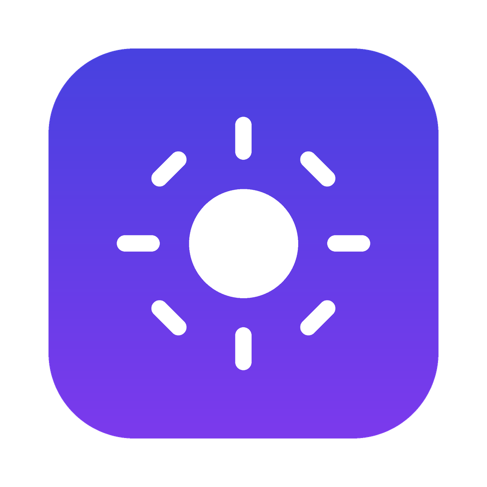
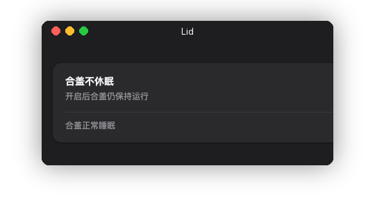

# Lid

<p align="center">
  
</p>

English | [简体中文](README.zh-CN.md)

<p align="center">
  
</p>

In the age of AI agents, Macs spend a lot of time working with nobody watching — builds, model training, crawlers, long-running agent tasks. Close the lid, and macOS puts everything to sleep.

**Lid is a tiny macOS app that solves exactly one problem: keep your Mac running after you close the lid.**

One switch, nothing else. It flips `pmset -a disablesleep 1/0` under the hood.

## Features

- **One switch** — lid-close sleep on / off, takes effect immediately
- **Secure** — the first toggle asks for your admin password (sudo); it is cached in memory for this session only, never written to disk or logs
- **Bilingual UI** — English / 简体中文, follows your system language automatically
- **Light & dark mode** ready

## How it works

| Switch | Command |
| ------ | ------- |
| ON     | `sudo pmset -a disablesleep 1` |
| OFF    | `sudo pmset -a disablesleep 0` |

## Build & Install

Requires Node.js and Rust.

```bash
npm install        # first time only
npm run build      # build Lid.app
```

The app is produced at `src-tauri/target/release/bundle/macos/Lid.app`. Or build and install to `/Applications` in one step:

```bash
./scripts/install.sh
```

## License

MIT
