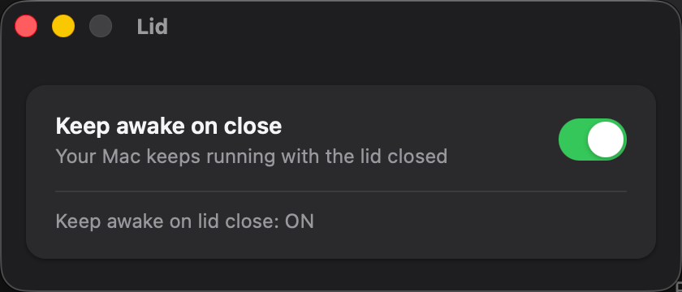

# Lid

<p align="center">
  
</p>

English | [简体中文](README.zh-CN.md)

<p align="center">
  
</p>

Here's the whole story. I carry my MacBook around — sometimes in hand on a walk, sometimes tucked into a backpack on the way out — while it keeps working with nobody watching: builds, model training, crawlers, long-running agent jobs. At some point I have to close the lid, and the second I do, macOS puts everything to sleep. The work just dies quietly in the backpack.

Could one line of `sudo pmset -a disablesleep 1` fix it? Yes. Do mature apps already do this? Also yes. But I just wanted this one tiny switch as a little app of my own — so I built it with WorkBuddy, and enjoyed the fun of creating things in the AI era. Want a small tool? Just make it.

**Lid does exactly one thing: keep your Mac running after you close the lid.**

One switch, nothing else.

## Features

- **One switch** — lid-close sleep on / off, takes effect immediately
- **Secure** — the first toggle asks for your admin password (sudo); it is cached in memory for this session only, never written to disk or logs
- **Bilingual UI** — English / 简体中文, follows your system language automatically
- **Light & dark mode** ready

## How it works

| Switch | Command |
| ------ | ------- |
| ON     | `sudo pmset -a disablesleep 1` |
| OFF    | `sudo pmset -a disablesleep 0` |

## Build & Install

Requires Node.js and Rust.

```bash
npm install        # first time only
npm run build      # build Lid.app
```

The app is produced at `src-tauri/target/release/bundle/macos/Lid.app`. Or build and install to `/Applications` in one step:

```bash
./scripts/install.sh
```

That's all it is. If you've ever closed the lid and wished your Mac would just keep working, this little app is for you.

## License

MIT
