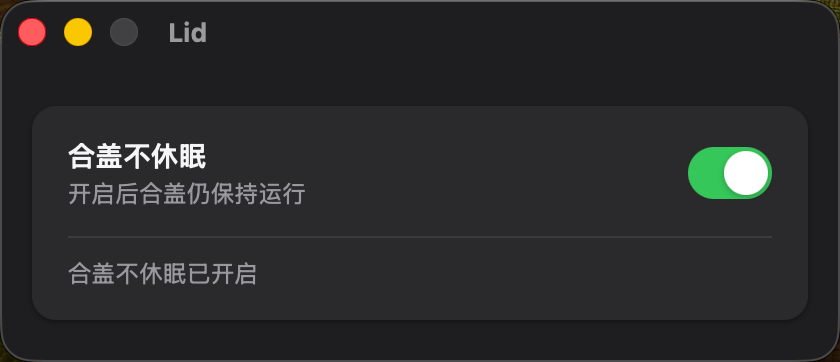

# Lid

<p align="center">
  
</p>

[English](README.md) | 简体中文

<p align="center">
  
</p>

这个应用的来历很简单。我平时抱着笔记本出门，要么拎在手上走，要么塞进书包里，机器上还跑着没人看的活，编译、训练模型、爬虫、长时间的 Agent 任务。走着走着，总得合上盖子。可 macOS 合盖就睡眠，盖子一合，活儿就交代在书包里了。

说实话，一行 `sudo pmset -a disablesleep 1` 就能解决，一些成熟的软件也有这个功能。但我就是想要这么一个小功能，于是用 WorkBuddy 把它做了出来，顺便享受了一把 AI 时代创造的乐趣。想要一个小工具，那就亲手把它做出来。

**Lid 是一个小小的 macOS 应用，只解决一个问题，合盖之后 Mac 继续干活不休眠。**

一个开关，别无其他。

## 特性

- **一个开关**，合盖睡眠开/关，即时生效
- **安全**，首次切换需要输入管理员密码（sudo），密码仅缓存在本次运行的内存中，不落盘、不写日志
- **双语界面**，中/英文，自动跟随系统语言
- **支持浅色与深色模式**

## 工作原理

| 开关 | 命令 |
| ---- | ---- |
| 开 | `sudo pmset -a disablesleep 1` |
| 关 | `sudo pmset -a disablesleep 0` |

## 构建与安装

需要 Node.js 和 Rust 环境。

```bash
npm install        # 仅首次需要
npm run build      # 构建 Lid.app
```

产物位于 `src-tauri/target/release/bundle/macos/Lid.app`。也可以一键构建并安装到 `/Applications`。

```bash
./scripts/install.sh
```

就这么多。如果你也有合上盖子、却希望 Mac 继续干活的时刻，拿去用吧。

## 许可证

MIT
